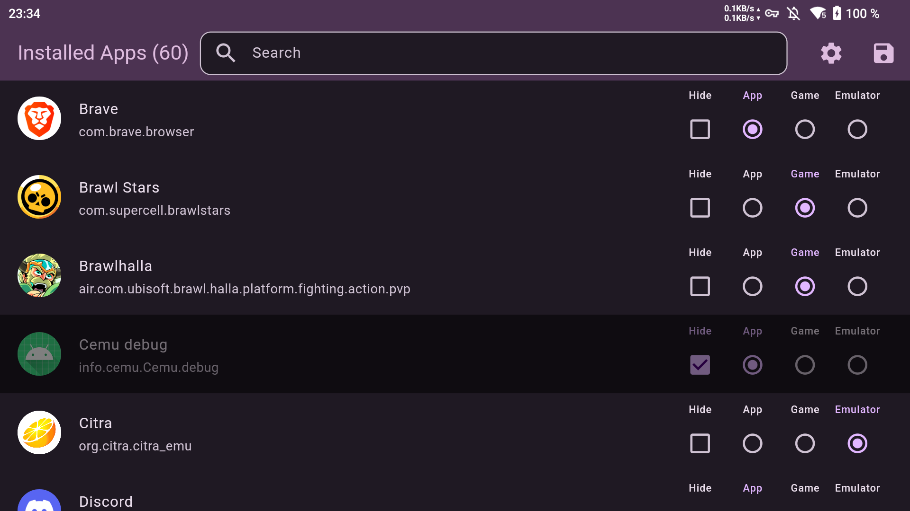

  

# ES-DE Android Apps
This tools imports android apps into the ES-DE launcher, you need to download it independently.

## New features
- Light/dark theme support, material you support, app icon
- Search bar to quickly find a package
- Whitelist mode for only adding specific apps
- More intuitive radio buttons layout
- Settings pages to prevent redundant directory selection
- Path check to prevent overwriting the wrong directories

## Settings
> [!NOTE]
> If you have multiple apps with the same name, hold click on one to rename it

- "use whitelist instead of blacklist": save the checked apps instead of the unchecked ones
- "do not save media": only save the es-de roms, not the app logos
- "delete existing files": overwrite all android roms from es-de on each save, useful when you uninstall an app and it stayed in the list
- "disable path name check": allows selecting a rom folder not named "ROMs"

## Credits
Inspired from [ES AppLauncher](https://github.com/schattenphoenix/es_applauncher), though obviously entirely made by myself since the former is close-source
